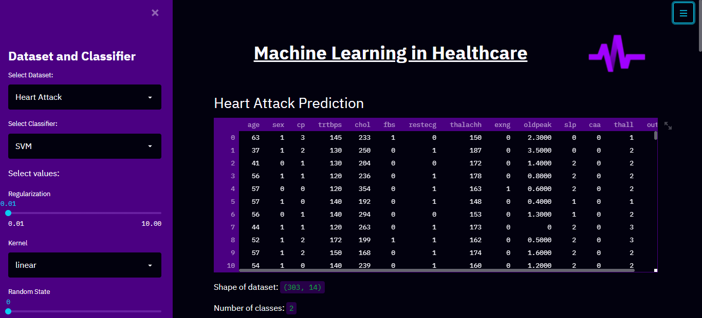
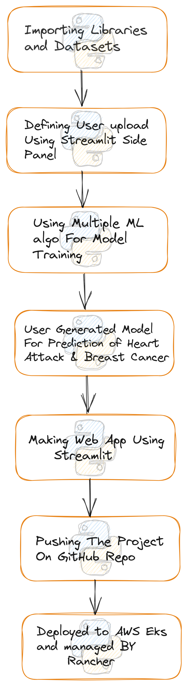

# ML Analysis In Healthcare App
---


This is an interactive Machine Learning Web App "ML in Healthcare" developed using Python and StreamLit. It uses differnet ML algorithms to build powerful and accurate models to predict the risk (High / Low) of the user of having a Heart Attack or Breast Cancer based on the user's specific attributes like age, sex, heart rate, blood sugar, etc.

The app can be visited at 

# About the App
The app has 2 major sections, first being Model Building.
In this section 7 different models are built using different ML algorithms. They are:
```ruby
1. Logistic Regression 
2. KNN
3. SVM 
4. Decision Trees 
5. Random Forest 
6. Gradient Boosting 
7. XGBoost
```
---  
An interactive side-dashboard is created using the streamlit st.sidebar call which enables the user to do the following:

- Choose dataset - `Heart Attack / Breast Cancer`

- Choose algorithm - `Logistic Regression` , `KNN` , `SVM` , `Decision Trees` , `Random Forest` , `Gradient Boosting` , `XGBoost`.

- Change the important parameters for each model - Learning Rate, Random State, Regularization Coeff, Gamma, Kernel, n_estimators etc.

After training using the parameters selected by the user, the tuned model is built and ready to be tested on our testing data. The classification plot and confusion matrix is displayed for the model selected along with the model metrics: Accuracy, Precision, Recall, F1-Score, Mean Squared Error, Execution Time. The user can observe real-time changes in the plots and metrics as they change the model parameters further.

The 7 models (optimum tuning) performed as follows: <br>
`Criterion: Accuracy`
Model | Accuracy (Heart Attack / Breast Cancer)
------------ | -------------
Logistic Regression | **91.803% / 100.0%**
KNN | **86.89% / 96.49%**
SVM | **93.44% / 100.0%**
Decision Trees | **52.56% / 60.53%**
Random Forest | **90.164% / 98.24%**
Gradient Boosting | **88.53% / 96.49%**
XGBoost | **95.08% / 94.737%**

The next section being User Prediction.
In this section, the user can use any model developed above to predict their status (High Risk / Low Risk) using their own values. (Either for Heart Attack or Breast Cancer)

# Screenshots of the web app:

<table style="width:100%">
  <tr>
    <th></th>
    <th></th>
  </tr>
  <tr>
    <th></th>
    <th></th>
  </tr>
 </table>
 
 
 # Flow Chart
 
 <table style="width:100%" align="center">
  <tr>
    <th></th>
  </tr>
 </table>

## Data Source

The models are trained using data from https://archive.ics.uci.edu/ml/index.php, particularly the Heart Attack Prediction and Breast Cancer (Wisconsin) datasets.

## How-to Guide
---
### Setting up Rancher on existing cluster

1. Push the Docker image to DockerHub or ECR
2. Create Your Cluster on EKS using [`eksctl`](https://github.com/weaveworks/eksctl) tool


3. Run Rancher on your local machine or on virtual machine:
<ul>
  <li>Install Docker on your system: https://docs.docker.com/engine/install/</li>
  <li>Install Rancher, visit: https://rancher.com/quick-start</li>
  
  > **Note**:- From rancher v2.0 docker may not support some features so try to install using Helm to get rid out of agent-disconnected error!
</ul>

Or use:
```ruby
sudo docker run --privileged -d --restart=unless-stopped -p 80:80 -p 443:443 rancher/rancher:latest
```

<ul>
  <li>Check for whether all pods of Rancher are running or not</li>
  
  
  
  <li>Now access the Web UI of the Rancher: `http://localhost:80`</li>
  <li>Rancher UI will open: <li>
  
  
  
  Now Run the command to get your bootstrap password or provide it while installing: 
  ```ruby
  kubectl get secret --namespace cattle-system bootstrap-secret -o -go-template='{{.data.bootstrapPassword | base64decode}}{{"\n"}}'
  ```
  
  <li>Create new passwords for Rancher</li>
  <li>Now on this tab we can create our new cluster or can import an existing one</li>
  <li>Importing EKS cluster</li>
  
  
  
  

  </ul>
  
### Now Deploying the ML app on created EKS cluster

1. Ensure that you have k8s tools installed, visit here for more details: https://kubernetes.io/docs/tasks/tools/ 

2. If you crated EKS cluster using eksctl tool then no need to add the cluster context on `.kube/config`. You can access your EKS by context-switching

  


3. Create a namespace `kubectl create namespace <namespace>`
5. Apply yaml files: 
<ul>
  <li>service</li>
  <li>deployment</li>
  
</ul>


Now access the loadbalancer external-ip on your browser to see the app is running on port `:8503`


### Want to Deploy this ML app on rancher-k3s cluster???

- Follow along all the steps [`here`](https://github.com/bishal7679/Rancher-k3s)

### Want to deploy on ECS cluster???

- Use this ECR image `420235819919.dkr.ecr.us-east-1.amazonaws.com/mlalgo4health:latest`

### Facing any Issues on Rancher agent disconnected or some error while importing Cluster???
REF :- 
- https://github.com/rancher/rancher/issues/36589#issuecomment-1181617212
- https://github.com/rancher/rancher/issues/29715
- https://ranchermanager.docs.rancher.com/troubleshooting/other-troubleshooting-tips/registered-clusters


